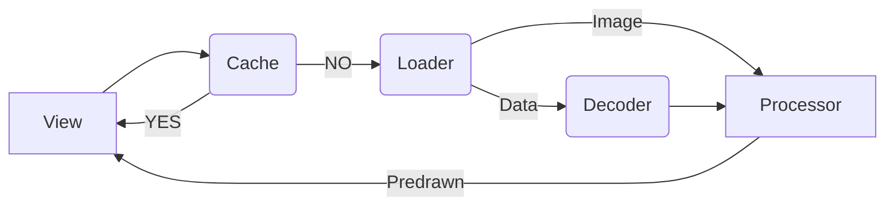

# ImageKit

support UIKit、AppKit、SwiftUI



## Feature
1. Cache: Memory
1. Loader: Disk、Local、Network
1. Decoder: Image、Gif
1. Processor: Predrawn、Gray

https://github.com/user-attachments/assets/a66e6534-51d5-46a7-a54b-10847446486a

## Usage
     
SwiftUI
```swift
ImageView(url: url, size: .absolute(size)) { isError in
    Text(isError ? "error" : "loading")
}
```
