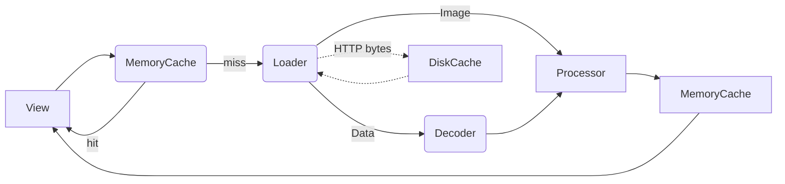

# ImageKit

Lightweight image loading for UIKit, AppKit, and SwiftUI.


```mermaid
graph LR
A[View] -->B(MemoryCache)
    B -->|hit| A
    B -->|miss| C(Loader)
    C -->|Data| D(Decoder)
    C -->|Image| E[Processor]
    D --> E
    E --> F[MemoryCache]
    C -.->|HTTP bytes| G[DiskCache]
    G -.-> C
    F --> A
```

## Feature
1. Cache: Memory (decoded) · Disk (raw bytes for network)
1. Loader: Local · Network
1. Decoder: Image · Gif
1. Processor: Predrawn · Gray

https://github.com/user-attachments/assets/a66e6534-51d5-46a7-a54b-10847446486a

## Usage

### SwiftUI

```swift
// Default loading / success / error UI
ImageView(url: url, size: .absolute(size))

// Own every phase
ImageCustomView(url: url, size: .absolute(size)) { phase, _ in
    switch phase {
    case .empty:
        ProgressView()
    case .success(let image):
        #if os(macOS)
        Image(nsImage: image).resizable().scaledToFill()
        #else
        Image(uiImage: image).resizable().scaledToFill()
        #endif
    case .failure:
        Text("error")
    }
}
```

### UIKit / AppKit

```swift
imageView.setImage(url: url)
```
